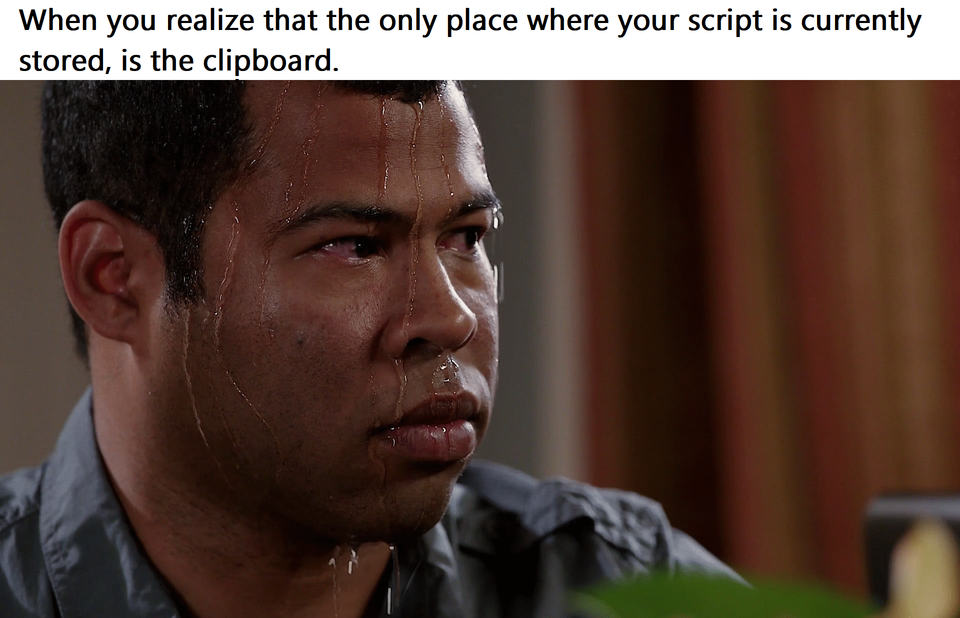
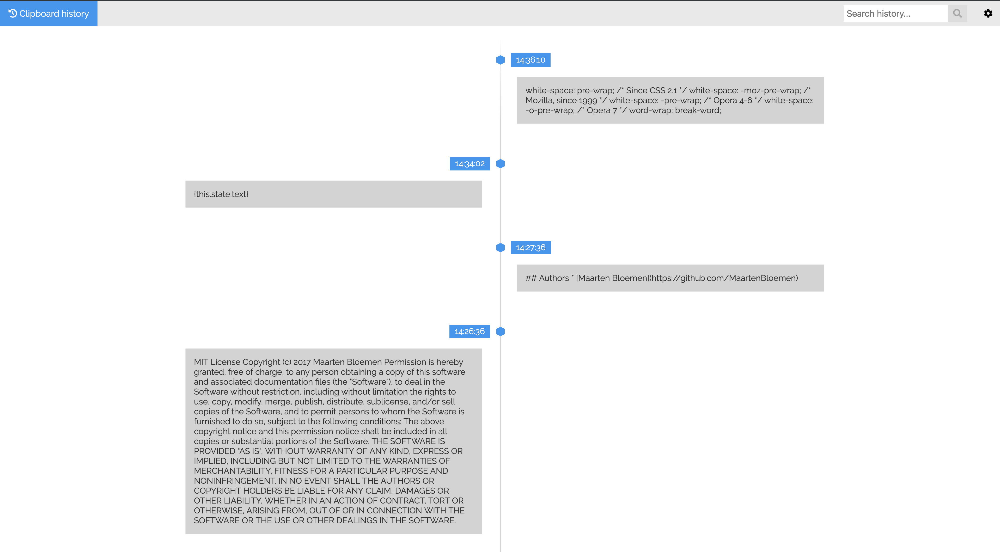

# Clipboard history

Cross platform clipboard history application build with Flask and React.

## Features
- [x] Clipboard text history
- [x] Copy item back to clipboard
- [ ] Search through clipboard history
- [ ] Automatically add new items to UI

## Dependencies
* Flask
* Flask-CORS
* Pyperclip

## Installation
1. Clone this repository: `https://github.com/MaartenBloemen/clipboard_history.git`
2. Install dependencies: `pip install -r requirements.txt`
3. Run the Flask backend: `python server.py`
4. In a browser navigate to: `http://localhost:8001`
5. Click on an item to copy it back to the clipboard.

## License
This project is licensed under the MIT License - see the [LICENSE.md](LICENSE.md)  file for details.

## Authors
* [Maarten Bloemen](https://github.com/MaartenBloemen) 